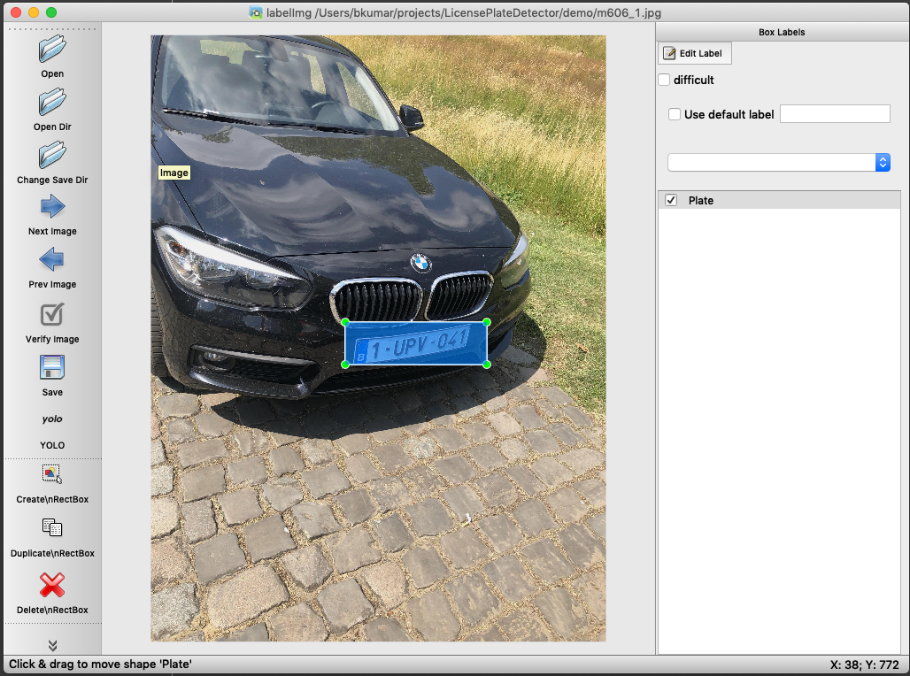

# Deep Learning based License Plate Recognition
License plate recognition using Deep Learning

In this project we put our best effort to train YOLOV3 and CNN for models License plates detection and identification.
There are three main modules in this project. 

## Presentation [here](Deep%20Learning%20based%20License%20Plate%20Recognition.pdf)

## Video Demo
You can watch the demo of our project from [here](https://drive.google.com/drive/u/1/folders/1JKOd7scInjmRnwaFD3pxZRCvDaYpGoDy)

## Approach
1. License plate detection using the YoloV3 weights that we trained specifically for this project. More details about this will be discussed later.
2. Segmentation of the plate by using two approaches
    1. Using Another custom YoloV3 trained weights
    2. Using openCV to adaptively find segments based on Contours
3. Character recognition using CNN and YOLOV3 from above step.

## Datasets
1. We have collected images for 700 cars (Belgium based) and multiple variations and angles for each car. 
2. We have also collected the images of license plates for these cars such that most of the image contains license plate. This enabled us to train the YoloV3 weights for segmentation and character recognition. We have also clicked a few pictures around our place to add them to the test dataset. 

3. Data related to all possible characters in the License plates were also collected and performed Image augmentation to perform the training on multiple permutaions of each image. We had nearly 1000 images per character.

You can download the datasets from this [link](https://drive.google.com/drive/folders/1G7x2Bn7z8MKFA6PdnLFGvOWvH7DOjLQw?usp=sharing). This folder contains all three datasets for Cars, License Plates and Characters

A few more images are also included in the dataset. We have used [LabelImg](https://github.com/tzutalin/labelImg) annotation tool to annotate license plates and the characters in the license plates.



## Annotations Conversion
The dataset we found has annotations compatible with ImageNet. We have written a method to convert these annotations into labels required by YoloV3 training. [Link here](Traning_Python/Yolo_LicensePlateDetection/annotations_xml_to_txt.py)

## Test Train Split
As we have limited set of images and considering how hard it is to manually annotate these images, we have chosen to split the data into 90% for training and 10% for testing.

## Data validation
The images we collected had a few discrepancies such as not having annotations files, mislabeled annotations, incorrect annotations, etc. We have validated the dataset and corrected/removed the invalid samples.

## Training Environment
We have used Amazon Linux 2 (Optimized for Deep Learning) EC2 instance for training Yolo weghts. Configuration of the box is as follows.
``` Shell
=============================================================================
       __|  __|_  )
       _|  (     /   Deep Learning AMI (Amazon Linux 2) Version 28.1
      ___|\___|___|
=============================================================================
Please use one of the following commands to start the required environment with the framework of your choice:
for MXNet(+Keras2) with Python3 (CUDA 10.1 and Intel MKL-DNN) ____________________________________ source activate mxnet_p36
for MXNet(+Keras2) with Python2 (CUDA 10.1 and Intel MKL-DNN) ____________________________________ source activate mxnet_p27
for MXNet(+AWS Neuron) with Python3 ___________________________________________________ source activate aws_neuron_mxnet_p36
for TensorFlow(+Keras2) with Python3 (CUDA 10.0 and Intel MKL-DNN) __________________________ source activate tensorflow_p36
for TensorFlow(+Keras2) with Python2 (CUDA 10.0 and Intel MKL-DNN) __________________________ source activate tensorflow_p27
for TensorFlow(+AWS Neuron) with Python3 _________________________________________ source activate aws_neuron_tensorflow_p36
for TensorFlow 2(+Keras2) with Python3 (CUDA 10.1 and Intel MKL-DNN) _______________________ source activate tensorflow2_p36
for TensorFlow 2(+Keras2) with Python2 (CUDA 10.1 and Intel MKL-DNN) _______________________ source activate tensorflow2_p27
for PyTorch with Python3 (CUDA 10.1 and Intel MKL) _____________________________________________ source activate pytorch_p36
for PyTorch with Python2 (CUDA 10.1 and Intel MKL) _____________________________________________ source activate pytorch_p27
for PyTorch (+AWS Neuron) with Python3 ______________________________________________ source activate aws_neuron_pytorch_p36
for Chainer with Python2 (CUDA 10.0 and Intel iDeep) ___________________________________________ source activate chainer_p27
for Chainer with Python3 (CUDA 10.0 and Intel iDeep) ___________________________________________ source activate chainer_p36
for base Python2 (CUDA 10.0) _______________________________________________________________________ source activate python2
for base Python3 (CUDA 10.0) _______________________________________________________________________ source activate python3
```

## Training statistics

### DarkNet - YOLOV3

```
Time taken by Darknet YoloV3 to detect License plates : approx 3 hrs
Number of classes in the image                        : 1
Number of steps                                       : 3000
Final Loss                                            : 0.06
```
```
Loaded: 0.000064 seconds
Region 82 Avg IOU: 0.912367, Class: 0.999911, Obj: 0.988241, No Obj: 0.000699, .5R: 1.000000, .75R: 1.000000,  count: 1
Region 94 Avg IOU: 0.879224, Class: 0.999873, Obj: 0.988050, No Obj: 0.000181, .5R: 1.000000, .75R: 1.000000,  count: 3
Region 106 Avg IOU: -nan, Class: -nan, Obj: -nan, No Obj: 0.000000, .5R: -nan, .75R: -nan,  count: 0
Region 82 Avg IOU: 0.855783, Class: 0.999574, Obj: 0.811980, No Obj: 0.000977, .5R: 1.000000, .75R: 1.000000,  count: 3
Region 94 Avg IOU: 0.822438, Class: 0.999391, Obj: 0.822041, No Obj: 0.000283, .5R: 1.000000, .75R: 1.000000,  count: 1
Region 106 Avg IOU: -nan, Class: -nan, Obj: -nan, No Obj: 0.000000, .5R: -nan, .75R: -nan,  count: 0
Region 82 Avg IOU: 0.809468, Class: 0.999944, Obj: 0.994728, No Obj: 0.000700, .5R: 1.000000, .75R: 1.000000,  count: 2
Region 94 Avg IOU: 0.779633, Class: 0.989911, Obj: 0.962763, No Obj: 0.000209, .5R: 1.000000, .75R: 0.500000,  count: 2
Region 106 Avg IOU: -nan, Class: -nan, Obj: -nan, No Obj: 0.000000, .5R: -nan, .75R: -nan,  count: 0
Region 82 Avg IOU: 0.876382, Class: 0.999712, Obj: 0.967811, No Obj: 0.000899, .5R: 1.000000, .75R: 1.000000,  count: 2
Region 94 Avg IOU: 0.886684, Class: 0.999665, Obj: 0.948150, No Obj: 0.000227, .5R: 1.000000, .75R: 1.000000,  count: 2
Region 106 Avg IOU: -nan, Class: -nan, Obj: -nan, No Obj: 0.000000, .5R: -nan, .75R: -nan,  count: 0
Region 82 Avg IOU: 0.866952, Class: 0.999303, Obj: 0.923214, No Obj: 0.001266, .5R: 1.000000, .75R: 1.000000,  count: 4
Region 94 Avg IOU: -nan, Class: -nan, Obj: -nan, No Obj: 0.000055, .5R: -nan, .75R: -nan,  count: 0
Region 106 Avg IOU: -nan, Class: -nan, Obj: -nan, No Obj: 0.000001, .5R: -nan, .75R: -nan,  count: 0
Region 82 Avg IOU: 0.896997, Class: 0.999974, Obj: 0.999685, No Obj: 0.000404, .5R: 1.000000, .75R: 1.000000,  count: 1
Region 94 Avg IOU: 0.857650, Class: 0.994540, Obj: 0.736418, No Obj: 0.000149, .5R: 1.000000, .75R: 1.000000,  count: 3
Region 106 Avg IOU: -nan, Class: -nan, Obj: -nan, No Obj: 0.000000, .5R: -nan, .75R: -nan,  count: 0
Region 82 Avg IOU: 0.868904, Class: 0.999901, Obj: 0.997830, No Obj: 0.000381, .5R: 1.000000, .75R: 1.000000,  count: 1
Region 94 Avg IOU: 0.883656, Class: 0.999894, Obj: 0.998879, No Obj: 0.000217, .5R: 1.000000, .75R: 1.000000,  count: 3
Region 106 Avg IOU: -nan, Class: -nan, Obj: -nan, No Obj: 0.000000, .5R: -nan, .75R: -nan,  count: 0
Region 82 Avg IOU: 0.848767, Class: 0.999893, Obj: 0.968309, No Obj: 0.000935, .5R: 1.000000, .75R: 1.000000,  count: 2
Region 94 Avg IOU: 0.895472, Class: 0.999681, Obj: 0.991489, No Obj: 0.000221, .5R: 1.000000, .75R: 1.000000,  count: 2
Region 106 Avg IOU: -nan, Class: -nan, Obj: -nan, No Obj: 0.000000, .5R: -nan, .75R: -nan,  count: 0
Region 82 Avg IOU: 0.943208, Class: 0.999923, Obj: 0.988130, No Obj: 0.000684, .5R: 1.000000, .75R: 1.000000,  count: 2
Region 94 Avg IOU: 0.829631, Class: 0.999840, Obj: 0.594969, No Obj: 0.000125, .5R: 1.000000, .75R: 1.000000,  count: 2
Region 106 Avg IOU: -nan, Class: -nan, Obj: -nan, No Obj: 0.000009, .5R: -nan, .75R: -nan,  count: 0
Region 82 Avg IOU: 0.838237, Class: 0.999692, Obj: 0.972253, No Obj: 0.000955, .5R: 1.000000, .75R: 1.000000,  count: 3
Region 94 Avg IOU: 0.821092, Class: 0.999730, Obj: 0.950273, No Obj: 0.000157, .5R: 1.000000, .75R: 1.000000,  count: 1
Region 106 Avg IOU: -nan, Class: -nan, Obj: -nan, No Obj: 0.000000, .5R: -nan, .75R: -nan,  count: 0
Region 82 Avg IOU: 0.852567, Class: 0.999732, Obj: 0.929514, No Obj: 0.000432, .5R: 1.000000, .75R: 1.000000,  count: 2
Region 94 Avg IOU: 0.756729, Class: 0.998755, Obj: 0.926493, No Obj: 0.000195, .5R: 1.000000, .75R: 0.500000,  count: 2
Region 106 Avg IOU: -nan, Class: -nan, Obj: -nan, No Obj: 0.000000, .5R: -nan, .75R: -nan,  count: 0
Region 82 Avg IOU: 0.844523, Class: 0.999688, Obj: 0.832736, No Obj: 0.000733, .5R: 1.000000, .75R: 1.000000,  count: 2
Region 94 Avg IOU: 0.797605, Class: 0.999975, Obj: 0.995801, No Obj: 0.000272, .5R: 1.000000, .75R: 0.500000,  count: 2
Region 106 Avg IOU: -nan, Class: -nan, Obj: -nan, No Obj: 0.000000, .5R: -nan, .75R: -nan,  count: 0
Region 82 Avg IOU: 0.818924, Class: 0.999857, Obj: 0.997116, No Obj: 0.000264, .5R: 1.000000, .75R: 1.000000,  count: 1
Region 94 Avg IOU: 0.843183, Class: 0.999914, Obj: 0.996877, No Obj: 0.000226, .5R: 1.000000, .75R: 1.000000,  count: 3
Region 106 Avg IOU: -nan, Class: -nan, Obj: -nan, No Obj: 0.000000, .5R: -nan, .75R: -nan,  count: 0
Region 82 Avg IOU: 0.901864, Class: 0.999781, Obj: 0.997062, No Obj: 0.000782, .5R: 1.000000, .75R: 1.000000,  count: 2
Region 94 Avg IOU: 0.788954, Class: 0.999435, Obj: 0.524586, No Obj: 0.000211, .5R: 1.000000, .75R: 0.500000,  count: 2
Region 106 Avg IOU: -nan, Class: -nan, Obj: -nan, No Obj: 0.000000, .5R: -nan, .75R: -nan,  count: 0
Region 82 Avg IOU: 0.725491, Class: 0.998672, Obj: 0.755271, No Obj: 0.000456, .5R: 0.500000, .75R: 0.500000,  count: 2
Region 94 Avg IOU: 0.838893, Class: 0.999872, Obj: 0.500832, No Obj: 0.000119, .5R: 1.000000, .75R: 1.000000,  count: 2
Region 106 Avg IOU: -nan, Class: -nan, Obj: -nan, No Obj: 0.000000, .5R: -nan, .75R: -nan,  count: 0
Region 82 Avg IOU: 0.883862, Class: 0.999803, Obj: 0.996992, No Obj: 0.000561, .5R: 1.000000, .75R: 1.000000,  count: 2
Region 94 Avg IOU: 0.806010, Class: 0.999845, Obj: 0.997554, No Obj: 0.000134, .5R: 1.000000, .75R: 1.000000,  count: 2
Region 106 Avg IOU: -nan, Class: -nan, Obj: -nan, No Obj: 0.000000, .5R: -nan, .75R: -nan,  count: 0
3000: 0.071277, 0.062509 avg, 0.000010 rate, 3.262568 seconds, 192000 images
Saving weights to ../Yolo_LicensePlateDetection/models/yolov3-license-plates.backup
Saving weights to ../Yolo_LicensePlateDetection/models/yolov3-license-plates_final.weights
[1]+  Done                    ./darknet detector train ../Yolo_LicensePlateDetection/config/license_plate.data custom/yolov3-license-plates.cfg darknet53.conv.74
```

```
Time taken by Darknet YoloV3 to detect License plates : approx 8 hrs
Number of classes in the image                        : 35
Number of steps                                       : 10000
Final Loss                                            : 0.11
```
```
Region 82 Avg IOU: -nan, Class: -nan, Obj: -nan, No Obj: 0.000002, .5R: -nan, .75R: -nan,  count: 0
Region 94 Avg IOU: 0.905687, Class: 0.999221, Obj: 0.999223, No Obj: 0.004023, .5R: 1.000000, .75R: 1.000000,  count: 28
Region 106 Avg IOU: -nan, Class: -nan, Obj: -nan, No Obj: 0.000000, .5R: -nan, .75R: -nan,  count: 0
Region 82 Avg IOU: -nan, Class: -nan, Obj: -nan, No Obj: 0.000001, .5R: -nan, .75R: -nan,  count: 0
Region 94 Avg IOU: 0.905448, Class: 0.999672, Obj: 0.998464, No Obj: 0.003964, .5R: 1.000000, .75R: 1.000000,  count: 28
Region 106 Avg IOU: -nan, Class: -nan, Obj: -nan, No Obj: 0.000000, .5R: -nan, .75R: -nan,  count: 0
Region 82 Avg IOU: -nan, Class: -nan, Obj: -nan, No Obj: 0.000001, .5R: -nan, .75R: -nan,  count: 0
Region 94 Avg IOU: 0.923281, Class: 0.999063, Obj: 0.999191, No Obj: 0.003330, .5R: 1.000000, .75R: 1.000000,  count: 28
Region 106 Avg IOU: -nan, Class: -nan, Obj: -nan, No Obj: 0.000000, .5R: -nan, .75R: -nan,  count: 0
Region 82 Avg IOU: -nan, Class: -nan, Obj: -nan, No Obj: 0.000008, .5R: -nan, .75R: -nan,  count: 0
Region 94 Avg IOU: 0.910670, Class: 0.998750, Obj: 0.997641, No Obj: 0.003025, .5R: 1.000000, .75R: 1.000000,  count: 27
Region 106 Avg IOU: -nan, Class: -nan, Obj: -nan, No Obj: 0.000000, .5R: -nan, .75R: -nan,  count: 0
Region 82 Avg IOU: -nan, Class: -nan, Obj: -nan, No Obj: 0.000001, .5R: -nan, .75R: -nan,  count: 0
Region 94 Avg IOU: 0.918176, Class: 0.999837, Obj: 0.998689, No Obj: 0.003685, .5R: 1.000000, .75R: 1.000000,  count: 28
Region 106 Avg IOU: -nan, Class: -nan, Obj: -nan, No Obj: 0.000000, .5R: -nan, .75R: -nan,  count: 0
Region 82 Avg IOU: -nan, Class: -nan, Obj: -nan, No Obj: 0.000086, .5R: -nan, .75R: -nan,  count: 0
Region 94 Avg IOU: 0.911177, Class: 0.998767, Obj: 0.999726, No Obj: 0.002503, .5R: 1.000000, .75R: 1.000000,  count: 27
Region 106 Avg IOU: -nan, Class: -nan, Obj: -nan, No Obj: 0.000001, .5R: -nan, .75R: -nan,  count: 0
Region 82 Avg IOU: -nan, Class: -nan, Obj: -nan, No Obj: 0.000001, .5R: -nan, .75R: -nan,  count: 0
Region 94 Avg IOU: 0.930338, Class: 0.999489, Obj: 0.996023, No Obj: 0.004232, .5R: 1.000000, .75R: 1.000000,  count: 28
Region 106 Avg IOU: -nan, Class: -nan, Obj: -nan, No Obj: 0.000000, .5R: -nan, .75R: -nan,  count: 0
Region 82 Avg IOU: -nan, Class: -nan, Obj: -nan, No Obj: 0.000001, .5R: -nan, .75R: -nan,  count: 0
Region 94 Avg IOU: 0.920477, Class: 0.999406, Obj: 0.991622, No Obj: 0.005174, .5R: 1.000000, .75R: 1.000000,  count: 28
Region 106 Avg IOU: -nan, Class: -nan, Obj: -nan, No Obj: 0.000000, .5R: -nan, .75R: -nan,  count: 0
Region 82 Avg IOU: -nan, Class: -nan, Obj: -nan, No Obj: 0.000002, .5R: -nan, .75R: -nan,  count: 0
Region 94 Avg IOU: 0.916951, Class: 0.999503, Obj: 0.999474, No Obj: 0.003158, .5R: 1.000000, .75R: 1.000000,  count: 27
Region 106 Avg IOU: -nan, Class: -nan, Obj: -nan, No Obj: 0.000000, .5R: -nan, .75R: -nan,  count: 0
Region 82 Avg IOU: -nan, Class: -nan, Obj: -nan, No Obj: 0.000001, .5R: -nan, .75R: -nan,  count: 0
Region 94 Avg IOU: 0.918948, Class: 0.999299, Obj: 0.997657, No Obj: 0.003971, .5R: 1.000000, .75R: 1.000000,  count: 28
Region 106 Avg IOU: -nan, Class: -nan, Obj: -nan, No Obj: 0.000000, .5R: -nan, .75R: -nan,  count: 0
Region 82 Avg IOU: 0.485698, Class: 0.849271, Obj: 0.954034, No Obj: 0.000251, .5R: 0.000000, .75R: 0.000000,  count: 1
Region 94 Avg IOU: 0.911966, Class: 0.999461, Obj: 0.997772, No Obj: 0.003562, .5R: 1.000000, .75R: 1.000000,  count: 26
Region 106 Avg IOU: -nan, Class: -nan, Obj: -nan, No Obj: 0.000000, .5R: -nan, .75R: -nan,  count: 0
Region 82 Avg IOU: -nan, Class: -nan, Obj: -nan, No Obj: 0.000002, .5R: -nan, .75R: -nan,  count: 0
Region 94 Avg IOU: 0.931336, Class: 0.999667, Obj: 0.998673, No Obj: 0.003827, .5R: 1.000000, .75R: 1.000000,  count: 28
Region 106 Avg IOU: -nan, Class: -nan, Obj: -nan, No Obj: 0.000000, .5R: -nan, .75R: -nan,  count: 0
Region 82 Avg IOU: -nan, Class: -nan, Obj: -nan, No Obj: 0.000001, .5R: -nan, .75R: -nan,  count: 0
Region 94 Avg IOU: 0.915919, Class: 0.999623, Obj: 0.999780, No Obj: 0.003975, .5R: 1.000000, .75R: 1.000000,  count: 28
Region 106 Avg IOU: -nan, Class: -nan, Obj: -nan, No Obj: 0.000000, .5R: -nan, .75R: -nan,  count: 0
Region 82 Avg IOU: -nan, Class: -nan, Obj: -nan, No Obj: 0.000007, .5R: -nan, .75R: -nan,  count: 0
Region 94 Avg IOU: 0.899716, Class: 0.998312, Obj: 0.997887, No Obj: 0.003960, .5R: 1.000000, .75R: 1.000000,  count: 28
Region 106 Avg IOU: -nan, Class: -nan, Obj: -nan, No Obj: 0.000000, .5R: -nan, .75R: -nan,  count: 0
Region 82 Avg IOU: -nan, Class: -nan, Obj: -nan, No Obj: 0.000001, .5R: -nan, .75R: -nan,  count: 0
Region 94 Avg IOU: 0.912103, Class: 0.999583, Obj: 0.999700, No Obj: 0.003408, .5R: 1.000000, .75R: 1.000000,  count: 27
Region 106 Avg IOU: -nan, Class: -nan, Obj: -nan, No Obj: 0.000000, .5R: -nan, .75R: -nan,  count: 0
Region 82 Avg IOU: -nan, Class: -nan, Obj: -nan, No Obj: 0.000001, .5R: -nan, .75R: -nan,  count: 0
Region 94 Avg IOU: 0.924464, Class: 0.998221, Obj: 0.999106, No Obj: 0.004380, .5R: 1.000000, .75R: 1.000000,  count: 28
Region 106 Avg IOU: -nan, Class: -nan, Obj: -nan, No Obj: 0.000000, .5R: -nan, .75R: -nan,  count: 0
10000: 0.112187, 0.119860 avg, 0.000010 rate, 3.656955 seconds, 640000 images
Saving weights to ../Yolo_CharacterSegmentation/models/yolov3_character.backup
Saving weights to ../Yolo_CharacterSegmentation/models/yolov3_character_10000.weights
Saving weights to ../Yolo_CharacterSegmentation/models/yolov3_character_final.weights
[1]+  Done                    ./darknet detector train ../Yolo_CharacterSegmentation/config/characters.data ./custom/yolov3_character.cfg darknet53.conv.74
```

Max batches are estimated by using the following formula
number of anchors `number of classes * 2000`

No. of filters= (5 + no. of classes) * 3

Number of steps are calculated by calculating 80%, 90% of total batches respectively.

[YoloV3_Plates.cfg](Traning_Python/custom/yolov3-license-plates.cfg)
[YoloV3_Charecters.cfg](Traning_Python/custom/yolov3_character.cfg)

Final yolo.weights that we obtained are later used to predict the license plates and corresponding characters. 

### CNN

We have also performed CNN for character recognition with the following network configuration

```
Model: "sequential"
_________________________________________________________________
Layer (type)                 Output Shape              Param #
=================================================================
conv2d (Conv2D)              (None, 100, 75, 32)       320
_________________________________________________________________
max_pooling2d (MaxPooling2D) (None, 50, 37, 32)        0
_________________________________________________________________
conv2d_1 (Conv2D)            (None, 48, 35, 64)        18496
_________________________________________________________________
max_pooling2d_1 (MaxPooling2 (None, 24, 17, 64)        0
_________________________________________________________________
conv2d_2 (Conv2D)            (None, 22, 15, 128)       73856
_________________________________________________________________
max_pooling2d_2 (MaxPooling2 (None, 11, 7, 128)        0
_________________________________________________________________
dense (Dense)                (None, 11, 7, 128)        16512
_________________________________________________________________
flatten (Flatten)            (None, 9856)              0
_________________________________________________________________
dense_1 (Dense)              (None, 35)                344995
=================================================================
Total params: 454,179
Trainable params: 454,179
Non-trainable params: 0
_________________________________________________________________
2020-05-19 07:00:33.811602: I tensorflow/core/platform/cpu_feature_guard.cc:142] Your CPU supports instructions that this TensorFlow binary was not compiled to use: AVX2 FMA
2020-05-19 07:00:33.832657: I tensorflow/core/platform/profile_utils/cpu_utils.cc:94] CPU Frequency: 2300040000 Hz
2020-05-19 07:00:33.833106: I tensorflow/compiler/xla/service/service.cc:168] XLA service 0x563d1bb88d70 executing computations on platform Host. Devices:
2020-05-19 07:00:33.833131: I tensorflow/compiler/xla/service/service.cc:175]   StreamExecutor device (0): <undefined>, <undefined>
2020-05-19 07:00:33.881827: W tensorflow/compiler/jit/mark_for_compilation_pass.cc:1412] (One-time warning): Not using XLA:CPU for cluster because envvar TF_XLA_FLAGS=--tf_xla_cpu_global_jit was not set.  If you want XLA:CPU, either set that envvar, or use experimental_jit_scope to enable XLA:CPU.  To confirm that XLA is active, pass --vmodule=xla_compilation_cache=1 (as a proper command-line flag, not via TF_XLA_FLAGS) or set the envvar XLA_FLAGS=--xla_hlo_profile.
Epoch 1/15
28400/28400 [==============================] - 93s 3ms/sample - loss: 0.3386 - acc: 0.9056
Epoch 2/15
28400/28400 [==============================] - 92s 3ms/sample - loss: 0.0305 - acc: 0.9905
Epoch 3/15
28400/28400 [==============================] - 92s 3ms/sample - loss: 0.0163 - acc: 0.9953
Epoch 4/15
28400/28400 [==============================] - 92s 3ms/sample - loss: 0.0178 - acc: 0.9951
Epoch 5/15
28400/28400 [==============================] - 92s 3ms/sample - loss: 0.0122 - acc: 0.9971
Epoch 6/15
28400/28400 [==============================] - 92s 3ms/sample - loss: 0.0112 - acc: 0.9967
Epoch 7/15
28400/28400 [==============================] - 92s 3ms/sample - loss: 3.2913e-04 - acc: 1.0000
Epoch 8/15
28400/28400 [==============================] - 91s 3ms/sample - loss: 0.0121 - acc: 0.9971
Epoch 9/15
28400/28400 [==============================] - 91s 3ms/sample - loss: 0.0056 - acc: 0.9986
Epoch 10/15
28400/28400 [==============================] - 91s 3ms/sample - loss: 0.0051 - acc: 0.9987
Epoch 11/15
28400/28400 [==============================] - 91s 3ms/sample - loss: 0.0071 - acc: 0.9979
Epoch 12/15
28400/28400 [==============================] - 91s 3ms/sample - loss: 0.0020 - acc: 0.9994
Epoch 13/15
28400/28400 [==============================] - 91s 3ms/sample - loss: 2.6113e-05 - acc: 1.0000
Epoch 14/15
28400/28400 [==============================] - 91s 3ms/sample - loss: 7.0005e-06 - acc: 1.0000
Epoch 15/15
28400/28400 [==============================] - 91s 3ms/sample - loss: 3.3496e-06 - acc: 1.0000
7100/7100 [==============================] - 6s 882us/sample - loss: 0.0041 - acc: 0.9989
0.99887323
```

You can download all our trained yoloV3 weights and models from this follow [link](https://drive.google.com/drive/u/2/folders/1Q9HEYx6YM2bC7DRuibrJ9bfikR79Sveh).

## Transfer Learning
We have used the weights that were trained on the Belgium cars dataset to predict the license plates of California. The model performed decently with at least 60-70% accuracy. 

## Conclusion
We are satisfied with the result we were able to achieve with the detection and identification of the license plate numbers. 

We have identified the following inferences.
1. Training the DarkNet was nearly impossible when we ran just on CPU. Training it on GPU enabled box wig th CUDA gave us at least 500x speed.
2. Darknet height and width plays a major role in achieving good accuracies.
3. Realized the importance of Image augmentation, Scaling and Graying images. 
4. Compared the accuracies by using darknet C compiled binaries and the TFNet wrapper by OpenCV. We had to play with scaling strategies to achieve better accuracies.
5. Identifying the license plate numbers in taking a very long time due to the default CPU compiled OpenCV

## Future Scope
1. We want to extend our project on Real Time License Plate Detection.
2. Compare the performance improvements between YoloV3 and YoloV4 when the darknet wrapper is available.
3. Find ways to collect datasets for the license plates of different states and countries.
4. Apply efficient transfer learning techniques and improve the existing weights and further reduce loss.
